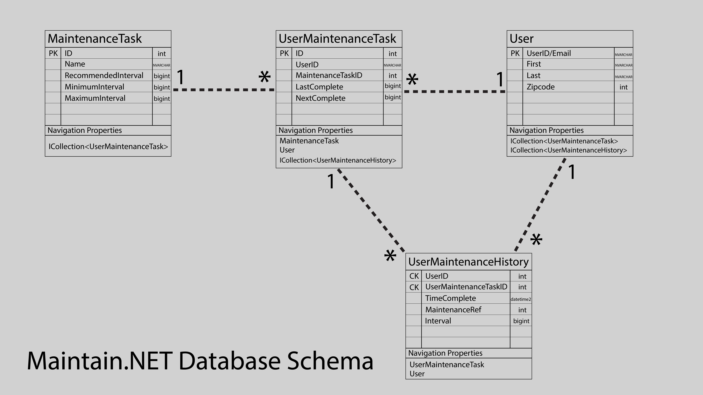
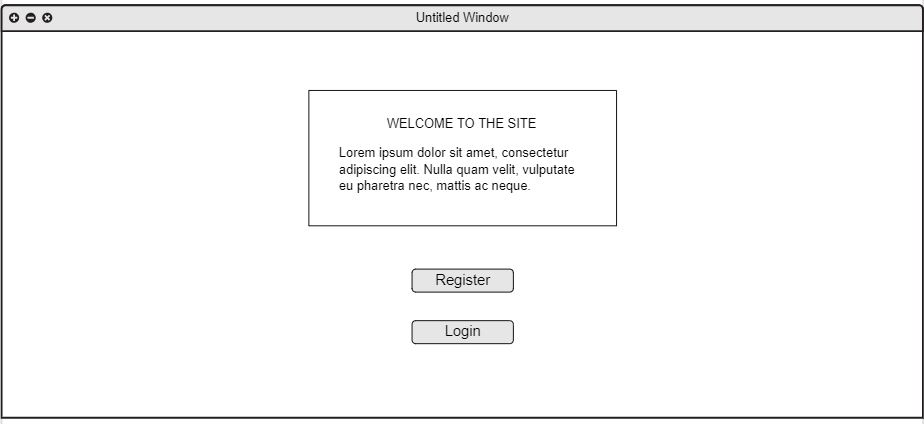
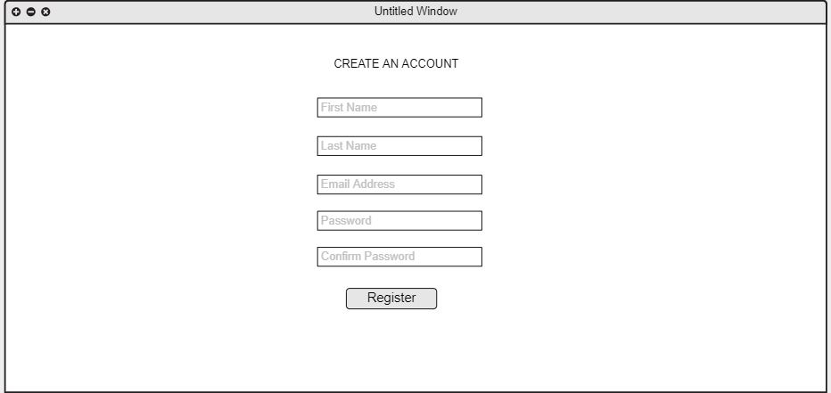
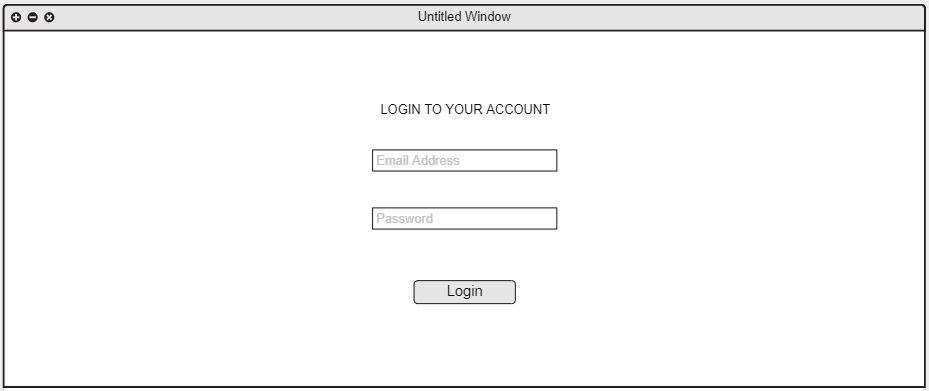
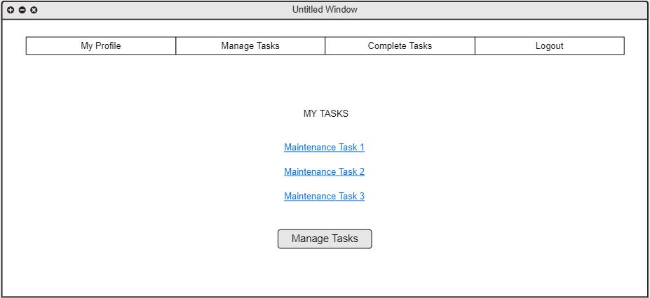
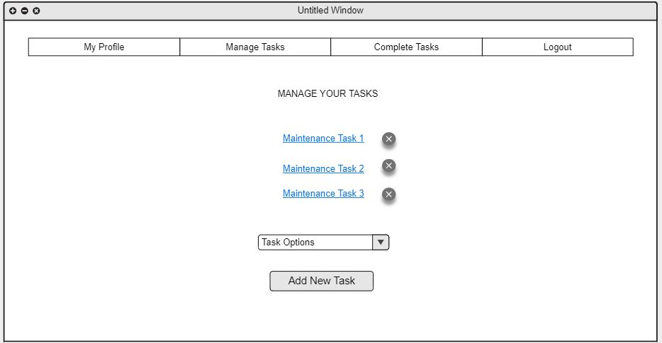
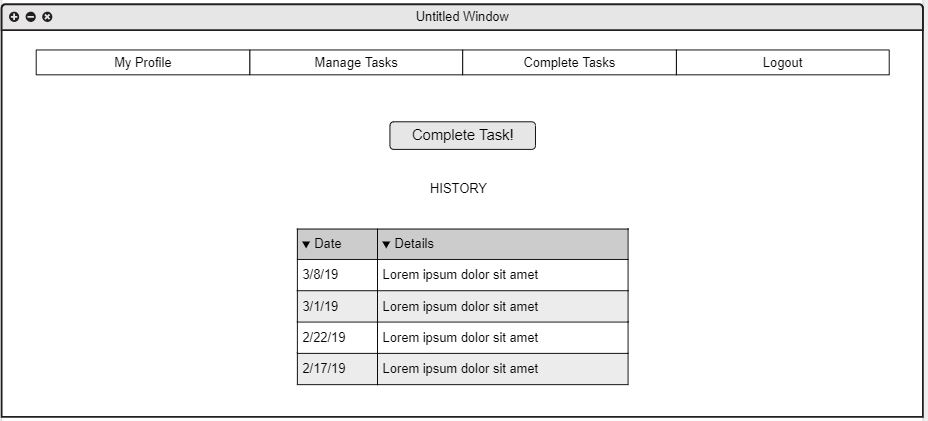

# Maintain.NET

## Deployed Site
https://maintainnet.azurewebsites.net/
## Overview
This app was designed for keeping up with routine maintenance task. This app will aid in keeping up with regular maintenance or task associated by sending reminder emails to the user about the task.
The app determines at what intervals the task will need to be completed through user input in addition to the input from other users doing the same task. Through machine learning, this interval is determined. 
The more submissions of completed, the more accurate the information becomes. 

The languages utilized in building this web app consit of HTML, CSS, and C#. 

## Tools Used
- ML net
- Sendgrid
- ASP.NET Core MVC
- SQL Database
- Entity Framework Core
- Microsoft Identity
- Azure DevOps
- Visual Studio

## Data Flow
- When a user lands on our site, they are introduced to the maintenance task tracking service and given the option to either register or login.  
- On the registration page, the user must input their first name, last name, email, and password.  
- This information will be saved into a user identity database.  
- If an account has already been created, the user can log in using their email and password.  
- Upon login, the user will land on a dashboard which shows their personal tasks and allows them to select a new task to add to the list.  
- Users have the option to click an individual task that redirects to a completion page which outlines a history of completed tasks.  
- This completion page also allows a user to mark a task as complete which sends data to the external database that collects aggregate data from all users.  

## Getting Started

- Clone the repository in to your local  machine.
- Add migration for MaintainDbContext
- Add migration to IdentityMaintainDbContext
- Update database for MaintainDbContext
- Update database for IdentityMaintainDbContext
- Run the application

#### Features
- Site Introduction Statement

- Registration form 
  - First name
  - Last name
  - Zip code
  - Email
  - Password
  - Password confirmation
  - Register button

- User login form
  - Email
  - Password
  - Login button

#### Acceptance Criteria

* Ensure that user always is directed to the landing page upon opening of the application.

* Ensure there are registration and login options 

### User Story 2 - User Dashboard

#### Features 

- Task links that redirect to task completion page

- Drop down menu containing task options
  - Change Oil
  - Water plants
  - Clean fish tank

#### Acceptance Criteria

* User will be directed to user dashboard after login.

* User have the ability to navigate to task history.

### User Story 3 - Task Management

#### Features

- Delete button for each task 
  - Add prompt to confirm deletion

- Add new task button

#### Acceptance Criteria

* The delete button will delete the instance of the a task.

* Add task will create a new instance of a task based on drop down menu.

### User Story 4 - Task Completion Page

#### Features 

- Complete task button submits data to task database

- Display a table of task completion history

#### Acceptance

* Ensure that user will be able to view their last 5 completed task submissions.

* Ensure that "Complete" button allow users to submit data and update history.

### User Story 5 - Task Reminders/Recommendations

#### Features

- Use Microsoft Sendgrid to send reminder emails based on set intervals  

- Utilize machine learning data to recommend task completion time on dashboard. 

#### Acceptance Criteria

* Receive an email from our service notifying user that their scheduled task is due.

* Provide the user with a suggested interval to complete the selected task.  

## Database Schema
- There will be two databases for this project.  
  - The first is the standard ASP.NET Core Identity database 
    - Database Name: IdentityContextDB 
    - Table: User
      - UserID/Email string (Primary Key)
      - First string
      - Last string
      - Zipcode int
  - The second database will be the main application database.
    - Database Name: MaintainContextDB
    - Table: UserMaintainenceTask
      - UserID string (Composite Key)
      - MaintainenceTaskID int (Composite Key)
      - LastComplete int
      - Navagation Properties
        - MaintainenceTask
        - User
        - ICollection<MaintenanceTaskData>
    - Table: MaintainenceTask
      - ID int (Primary Key)
      - Name string
      - RecommendedInterval int
      - Navagation Properties
        - ICollection<MaintenanceTaskData>
    - Table: MaintainenceTaskData
      - MaintainenceTaskID int (Foreign Key)
      - UserMaintenanceTaskID int 
      - ActualInterval int

## Wireframe

## Contributors
  Deziree Teague 
  
  Jason Few   
  
  Jason Hiskey https://github.com/jlhiskey  
  
  Ray Johnson 
  

